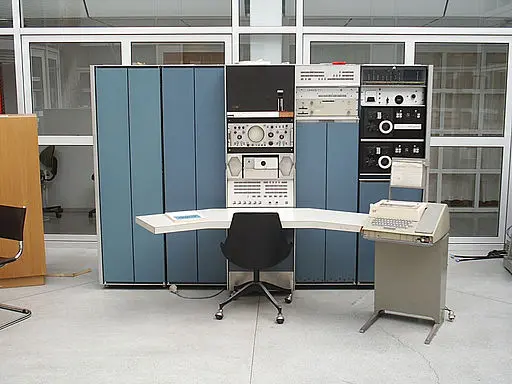

<figure>

<figcaption>PDP-7 <a href="#footnote1" id="1">1</a></figcaption>
</figure>

The 1960s were mainly the years of mainframes and minicomputers. In this section, we cover the operating systems for minicomputers only. Mainframe operating systems are covered in [this blog post](/blog/mainframe-operating-system-of-1960s/). It contains links to external sites with instructions on how to install those operating systems in emulators.

<section class="section section-sm">
  

    

      

        
<a class="btn btn-primary btn-lg px-4 mb-1" href="1965/" role="button">1965</a>

      

      

        
<a class="btn btn-primary btn-lg px-4 mb-1" href="1968/" role="button">1968</a>

      

    

  

</section>

<a href="#1" id="footnote1">1</a> <a href="https://commons.wikimedia.org/wiki/File:Pdp7-oslo-2005.jpeg">en:User:Toresbe</a>, <a href="http://creativecommons.org/licenses/sa/1.0/">CC SA 1.0</a>, via Wikimedia Commons
