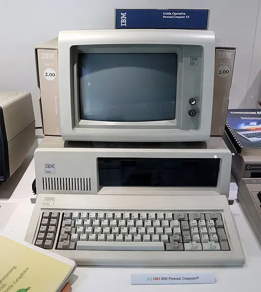

<figure>

<figcaption>IBM PC <a href="#footnote1" id="1">1</a></figcaption>
</figure>

1981 was the year when things started to become exciting. Many OS and software were released in this year, most notably the IBM PC-DOS and MS-DOS.

<section class="section section-sm">
  

    

      

        
<a class="btn btn-primary btn-lg px-4 mb-1" href="dos/" role="button">DOS</a>

      

    

  

</section>

<a href="#1" id="footnote1">1</a> <a href="https://commons.wikimedia.org/wiki/File:IBM_personal_computer,_1981.jpg">Sailko</a>, <a href="https://creativecommons.org/licenses/by/3.0">CC BY 3.0</a>, via Wikimedia Commons
