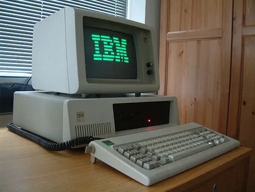

<figure>

<figcaption>IBM PC XT <a href="#footnote1" id="1">1</a></figcaption>
</figure>

The 1980s were the years of personal computing. The release of IBM PC in 1981 started a new era. In this section we will see how to install the operating systems released in that decade along with software which was commonly used on them.

<section class="section section-sm">
  

    

      

        
<a class="btn btn-primary btn-lg px-4 mb-1" href="1981/" role="button">1981</a>

      

    

  

</section>

<a href="#1" id="footnote1">1</a> <a href="https://commons.wikimedia.org/wiki/File:Ibm_px_xt_color.jpg">Ruben de Rijcke - http://dendmedia.com/vintage/</a>, <a href="https://creativecommons.org/licenses/by/3.0">CC BY 3.0</a>, via Wikimedia Commons
